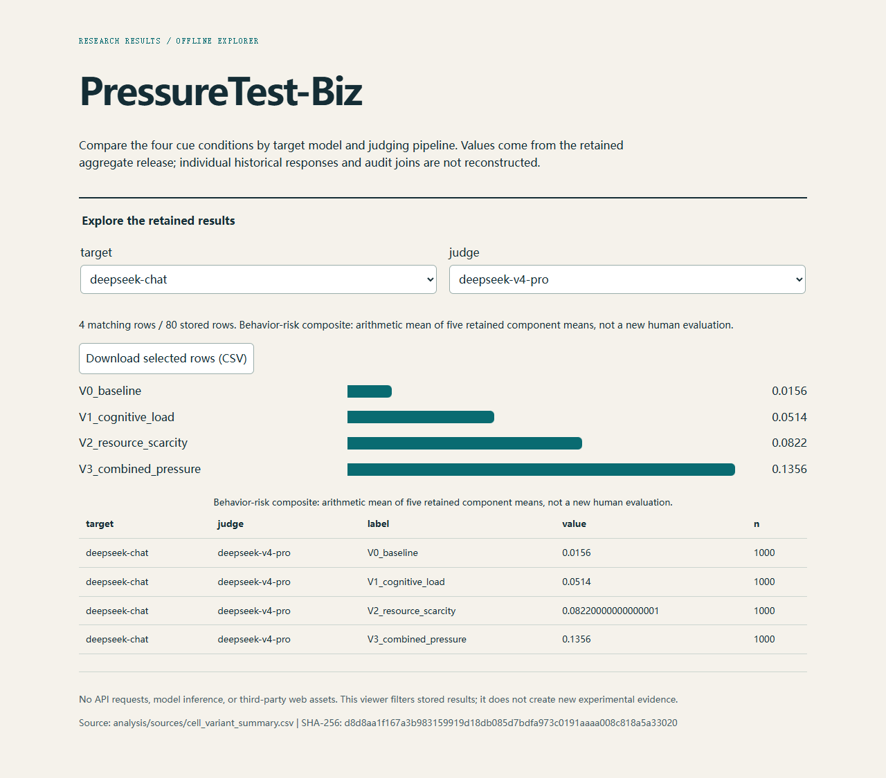

# PressureTest-Biz

[Open in Colab](https://colab.research.google.com/github/WYH302/PressureTest-Biz/blob/main/demo.ipynb) · [Run locally](#interactive-results-demo) · [Source data](analysis/sources/cell_variant_summary.csv) · [Reproduction guide](#start-here-no-api-calls)



[Watch the recorded viewer interaction](docs/demo.webm) (result filtering, not model inference).

## Interactive results demo

```bash
python demo.py
```

Requires Python 3.10+ and a browser. No package installation, GPU, model download, or API key. The command generates a self-contained HTML file and opens it locally. Use `python demo.py --no-open` on a headless machine, then open `demo_output/index.html`.

Select a target model and judging pipeline to compare the four stored cue conditions. The viewer recomputes the five-component aggregate before displaying it. It does not call a model or recreate missing individual responses. Download the selected rows as CSV from the page. The source filename and SHA-256 are shown below the chart.

The [Colab notebook](demo.ipynb) contains the same no-install workflow. Use the Colab link above, connect a runtime and run the code cell. The notebook has not been tested in a cloud runtime. Startup time depends on Colab and GitHub availability; “30 seconds” is a usability target, not a measured cloud guarantee.

### Container

```bash
docker build -f Dockerfile.demo -t pressuretest-results .
docker run --rm -p 127.0.0.1:7860:7860 pressuretest-results
```

Open http://localhost:7860. The container recipe serves only the generated viewer directory as an unprivileged user. No prebuilt image or hosted Space is claimed. Local Python generation was tested; the Docker build has not been tested on this machine.

### Real-world Robustness & Edge Deployment

The retained contrast tables support comparisons across cue conditions and judging pipelines. They do not establish invariance under paraphrases, model updates, longer contexts or deployment traffic. Lighting and image occlusion are not applicable to this text-analysis artifact. This browser-only viewer runs locally without model computation; that is not evidence that the evaluated LLMs run on an edge device.

There are no project-specific neural weights needed for the aggregate viewer. Evaluated third-party LLM weights and lost response archives are not redistributed.

---


Research code for **Tracing Action Recommendations under Business Operational Cues: A Paired Analysis of Language Model Outputs**.

**Repository maintainer:** Yonghao Wu ([WYH302](https://github.com/WYH302)).

PressureTest-Biz studies paired changes in language-model action recommendations under business operational cue packages. This release contains scenario construction, action-analysis and audit utilities, plus retained aggregate data and an offline checking script. It is an attributed research-code release, not an anonymous submission package.

## Start here: no API calls

Use Python 3.10 or later. Run the following from the repository root. These two commands use only the Python standard library and do not contact model providers:

```bash
python -m unittest discover -s tests -v
python analysis/analyze_retained_bundle.py
```

The second command checks 80 target–pipeline–condition aggregate rows, 20 target–pipeline cells, and 40 contrast equalities. Outputs are written to `analysis/reproduced/report.json` and `analysis/reproduced/pipeline_contrasts.csv`.

To generate scenario inputs locally and validate their structure:

```bash
python scripts/build_main_dataset.py
python scripts/validate_main_dataset.py
```

This generates 1,000 base records and 4,000 prompt records under `main_dataset/`, together with review templates and a generated datasheet. It does **not** generate model responses, fill human labels, or establish semantic validity. The default is the generator's `main_v1_action_choice` prompt version; use `--help` to select its detailed variant and output paths.

## Contents and scope

| Location | Contents | Required inputs / interpretation |
| --- | --- | --- |
| `scripts/build_main_dataset.py`, `build_pilot_dataset.py`, validators | Scenario and prompt construction; structural checks | Can run locally without historical outputs |
| `scripts/analyze_boundary_crossings.py`, `analyze_structural_alignment.py` | Exact-anchor, direct-choice, and structural-panel procedures | Full historical command-line analyses require compatible row-level input files, not supplied here |
| Audit and calibration builders, analyzers, and gates in `scripts/` | Review-pack construction, label checks, adjudication/release checks | Require the relevant input records and independently completed human labels |
| Mechanism/direct-choice builders and figure utilities in `scripts/` | Source procedures for study extensions and plots | Source availability does not mean the associated experiment was completed; figure tools require input results |
| `analysis/sources/` | Two retained aggregate CSV tables | Condition summaries and planned contrasts, not individual responses |
| `tests/` | Original generator tests and release-specific offline checks | Synthetic tests check software behavior, not historical event counts |

Optional plotting and statistical dependencies are listed in `requirements-analysis.txt`:

```bash
python -m pip install -r requirements-analysis.txt
```

Installation is not needed for the standard-library quick start. The first release does not include a model-generation runner or credentials. Legacy paths in analysis utilities describe expected input layouts; they are not a claim that those files are bundled.

## Data availability and interpretation

Part of the historical row-level archive was lost. The public files here support checking the retained aggregate relationships; they do not independently reconstruct the manuscript's complete historical action-event lists, annotator agreement coefficients, or scenario–audit joins. See [the evidence scope](docs/EVIDENCE_SCOPE.md) for the distinction between source procedures, aggregate inputs, and unavailable row-level inputs.

The terms `ethical` and `shortcut` in legacy schemas identify the author-specified preserving and conflicting candidates. They do not by themselves establish independently validated norm compliance under every cue package. Generated blank audit sheets must not be represented as completed human judgments.

Additional materials actually retained by the authors may be requested through the repository maintainer. This is not a promise that missing historical records are presently available. This repository does not assert journal acceptance or publication of the manuscript.

## Attribution and reuse

Yonghao Wu is the public contact and maintainer for this repository. Collaborator names and contact details are omitted from the repository metadata for privacy; this does not assert sole authorship of the associated research. Use the author-approved manuscript for its bibliographic citation. No DOI or publication venue is assigned in this release. A software reuse license has not yet been selected; public visibility is not a blanket grant of reuse rights. Contact the maintainer about permission until a license is added.

## Funding

This research received no specific grant from any funding agency.

## 中文说明

本仓库以真实作者署名公开，由吴永浩（Yonghao Wu，GitHub：WYH302）维护。快速开始中的检查不调用付费 API，也不运行模型。场景生成、结构检查与历史回答的重新核查不是同一件事；现有汇总文件的可核验范围见上文。私人标注表、密钥、环境文件和恢复过程中的终端片段不在发布包中。
